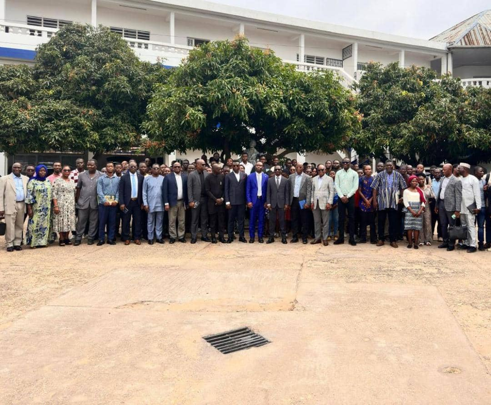

## Journal du 24 Août 2026 (rédigé par Afi Dibaya Claire ALAKA)

## Fait aujourd'hui 
- La journée a débuté par la cérémonie d'ouverture de la formation des Fabmanages à l'animation des Fablabs et centre régionaux d'inovation technologique par le ministre de l'éducation national Mr MAMA Omorou et ces colaborateurs,en présence de Mr Emile Nguissan directeur de INFPP, le directer de la FNAFPP,les formateurs les fiture Fabmanagers et certains invités à l'institut national de la formation et de perfectionnement professionele INFPP de lomé.
- visite du ministre de l'éducation national et ces colaborateurs,les directeurs, les formateurs aux lieus d'instalation des machines.
- Photo d'enssemble.
- Présentation des formateurs par leurs nom et parcours et nous également.
- Remise des ordinateurs à ceux qui n'avait pas.
- Partage et instalation des logiciels Git et VSCode.
- Notion sur la documentation.

  
## Appris
- Notion sur documenter avec Git,GitHub,GitHub Pages et le pourquoi nous devons faire la documentation sur chaque étapes.
- Les fonction de la documentation (mémoire, transmition) et ces principesss. 
- Le cadre de la formation tel que le calendrier des jalons, le poid dans la note et les rituels quotidiens.
- Les rôles des outils comme VSCode,Git GitHub GItHub pages.
- Notion de markdown, aide-mémoire syntaxique et les pièges qui endécoules.

## Raté, puis corrigé 
 J'ai eu des dificultés à ouvrir mon logiciel VSCode, mais avec l'aide d'un encadreure j'ai pui le corrigé.
  
## Décidé
J'ai décidé de faire des exercices pratiques d'utilisation du VSCcode. 
 
## À faire demain
Ouvrir mon compte GitHub. 