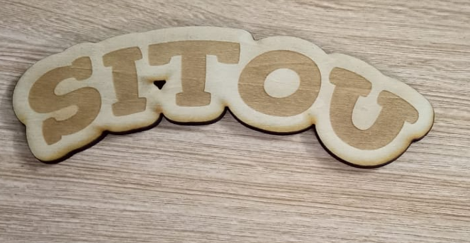
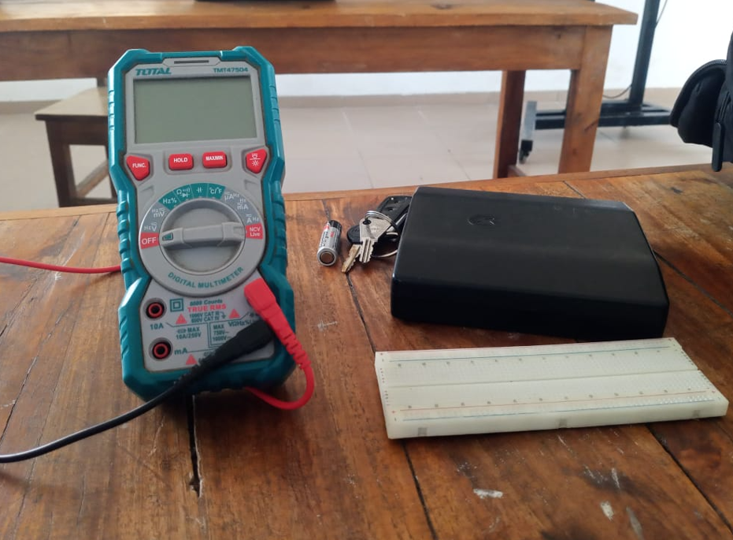

## Journal du 26 Août 2026 (rédigé par Afi Dibaya Claire ALAKA)

## Fait aujourd'hui
 
- La journée a débuté par la constitution des groupes et répartition dans differents ateliers par rotayion. 
- Découverte de plusieurs types de machines et leurs fonctionement.
- les différents  types de microcontroleurs.
- Les bases de l'électronique 
- La fabrication additive
- Notion sur la découpe Laser.
- visite d'une délégation des Nation Unis avec leurs mots d'encouragement. 

## Appris
# Atelier de projet
- Notion des cartes telque XIAOSP32-S3 et XIAO SP32-C3
  

# Atelier du découpe laser
- Les familles du découpe laser industriel: CO2, Fibre,Diode et UV.
- le choix d'une machine se fait par croisement. 
- La sécurité des machine: les classes 60825-1
- comparaison des machines XTool: F2 ultra P3,métalFab M1Utra
- Ecrir mon nom sur le logiciel XTool et l'imprimé
  

# Atelier d'électronique
- Les grandeurs électrique à savoir Tension Courant et la Résistance.
- Le multimètre est un outil de Fablab
- Mesure de la tension du courant alternatif et de la résistance au borne de deux piles différentes à l'aide du multimètre

# Atelier d'impression 3d
- La fabrication additive dons l'essentiel conserne l'historique de l'impression 3d et ces principes
- Les grande familles de technologies et leurs tableaux comparatif
- Les technologies les plus utilisés sont la FDM et SLA
- Le choix du filament et son chemin

## Décidé
- J'ai décidé de revoire mon cours de l'électricité.