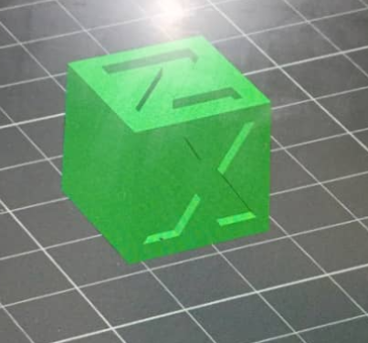
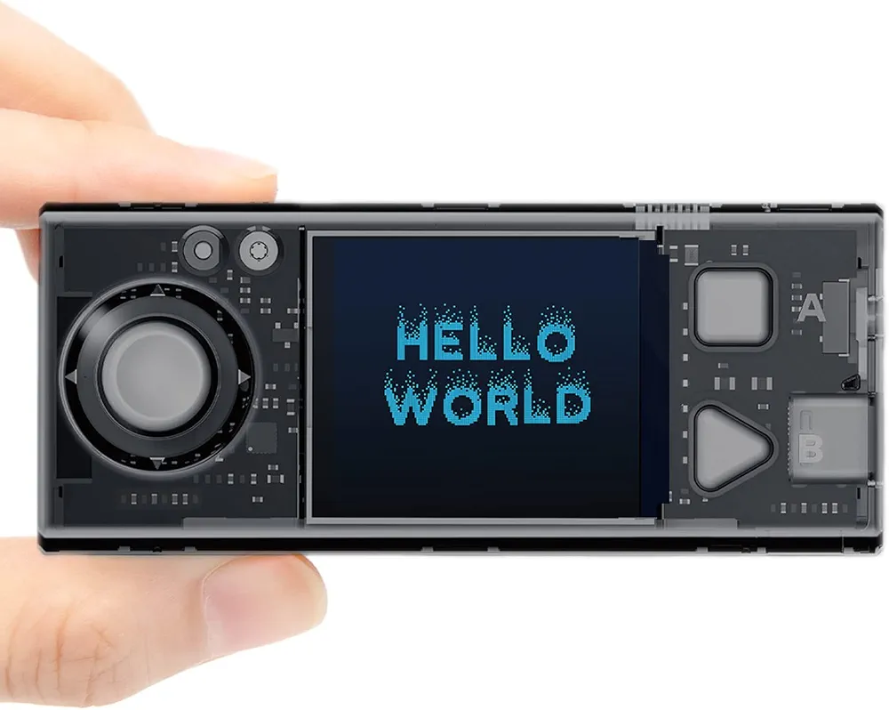
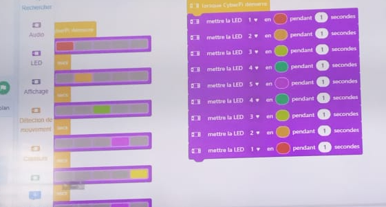

## Journal du 27 Août 2026 ( rédigé par Afi Dibaya Claire ALAKA) 

## Fait aujourd'hui
- Contrôle de présence et chaque groupes s'est dirigés dans les diferents atelies

# Atelier de l'imprimante 3d
- Instalation du logiciel banbustudio
- Rappel sur les principes de l'impression 3d 
- comment passer de l'image à l'objet

# Atelier de découpe laser
- Instalation du logiciel Xtool
- Découper une carte de visite

# Atelier de projet
- Instalation du logiciel Fusion client

## Atelier électronique
- Suite de la programmatoin des couleurs

## Appis
# Atelier de l'impression 3d
- Importer une image en 3d
- Imprimer un objet en 3d
- Orientation de la pièce

# Atelier de découpe laser
- Ecrir une carte de visite et la découpé au laser 

# Atelier d'electronique
- Programer un code de couleurs: une guirlande
- Comender le Led sur la cyberPi

## Raté, puis corrigé 
- J'ai eu des dificultés à écrire une carte de visite avec l'aide de l'encadreure j'ai pui l'écrire
- Je n'ai pas pui programé le code de couleur d'une guirlande et je l'es corrigé après la correction du formateur.
 
 ## Décidé
 - j'ais décidé de m'entraîner sur l'écriture dans le XTool
 - je vais m'entraîner sur la programation du code des couleurs