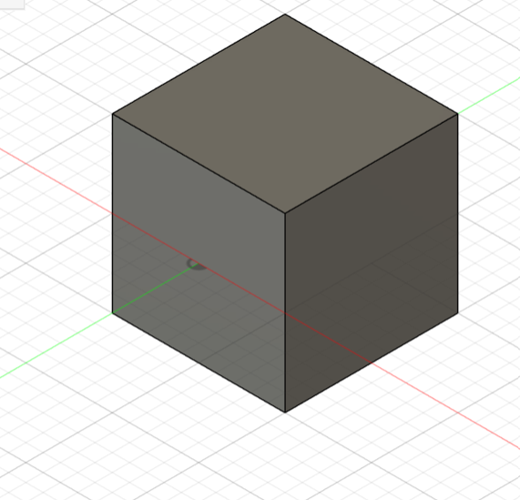

## Journal du 31 Août 2026 (rédigé par Afi Dibaya Claire ALAKA)

## Fait aujourd'hui
- Contrôle de présence
- Partage d'ordinateurs
- Discution sur les projets intégrateurs final et élaboration des fiches des matériaux à utiliser
- Découvrir le logiciel Fusion 360 et comprendre son utilité dans la chaîne de fabrication numérique

## Appris
- Avec Fusion, on peut concevoir une pièce en 3d sur ordinateur,tester si elle est solide avec la simulation puis envoiyer pour l'imprimer en 3D
- La fusion est un logiciel qui réunit la modèlisation 3d, la simulation, et la fabrication dans un seul outil
- Un exemple de fabrication du cube magie de 10 par 10
- Comprendre comment passer d'un modèle 3d sur fusion 360 à une pièce réel
- Avant de modèliser mon boîtier sur Fusion 360, je dois d'abord faire le plan 2d avec toutes les cotes des trous
 

## Raté, puis corrigé
 Au début je n'arrivais pas à déciner une cube magie par fusion avec l'aide j'ai pu le concevoir

 ## Décidé
 J'ai décidé de faire des exercices de fusion pour m'entraîner 
