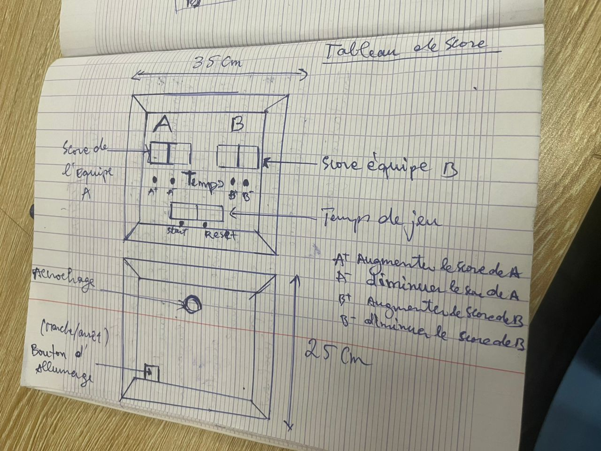
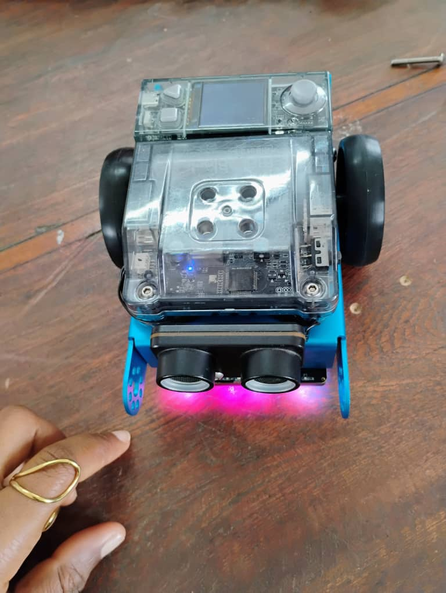
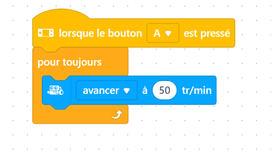

## Journal du 02 Septembre 2026 (rédigé par Afi Dibaya Claire ALAKA)

## Fait aujourd'hui
- Contrôle de présence
- Remise des PC
- Répartition des groupes dans les différents ateliers

## Appris

# Atelier de Découpe Laser
- Un Algorithme est une suite d'instructions claires et ordonnées pour résoudre un problème 
- L'algorithmique débranchée c'est apprendre à penser comme une machine sans utilisé un ordinateur
- Comprendre les concepts Séquence, Condition, Boucle,et fonction
- Un exemple se l'algorthme

# Atelier de projet
Un zéro sur le projet d'intégrateur final et élaboration d'un exemple de plan

# Atelier d'electronique
Réaliser le montage d'un robot mBot ou un robot éducatif de type Makeblock mBot suiveur de ligne

## Raté puis corrigé
Au début j'avais mal fait le montage du robot et avec l'aide j'ai pu le rémonter

## Décide
j'ai décidé de m'entraîner sur les exercices de l'algorithmes pour bien faire la programmation

## Á Faire demain
Suite du cours sur l'algorhithme