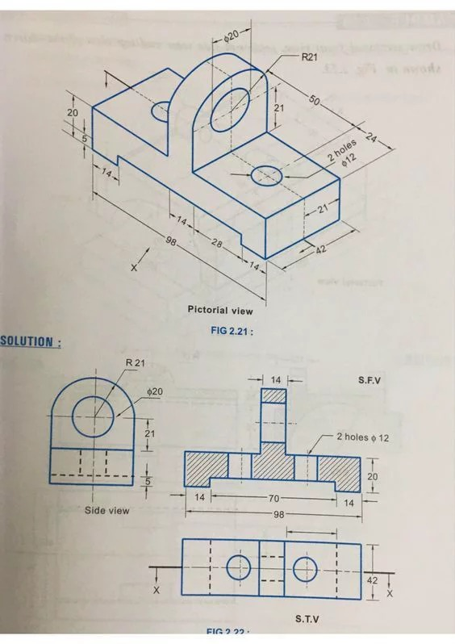
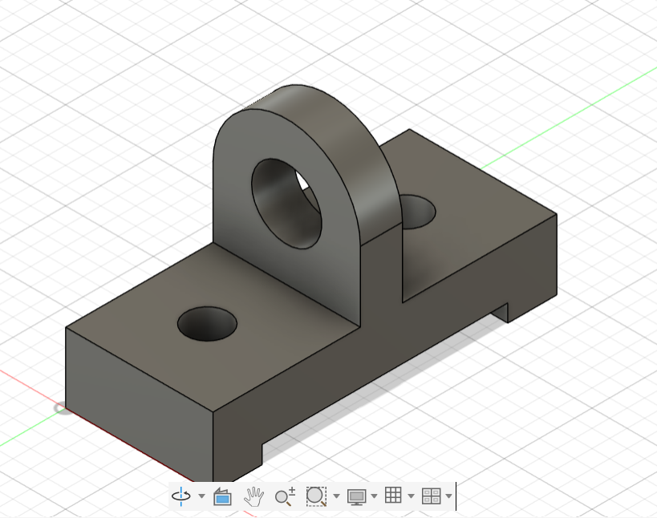
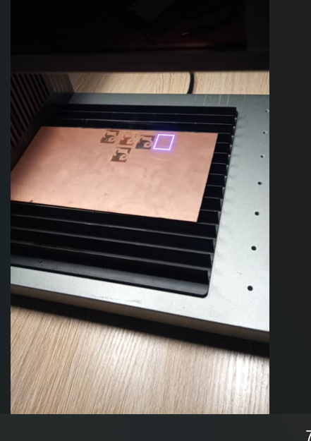

## Journal du 04 Septembre 2026 (rédigé par Afi Dibaya Claire ALAKA)

## Fait aujourd'hui
- Remise des ordinateurs
- Répartition des ateliers par groupes et par rotation
- Suite du cours sur la programmation de python
- Fabrication des PCB

## Appris
# Atelier de projet
- Rappel des bases :
. Les variables: str, int, float,bool
. Les opérateurs de comparaison: ==, !,=,≺,≻=,≺=
. Les opérateurs logiques: and,or,not
- Les conditions: if / elif / else
- Exercice1: Fiche technique d'un matériau
variable input(), calcul, f-string
- Exercice2: contrôle d'accès à une machine

# Atelier d'impression 3D
Exercice sur la modèlisation avec Fusion 360

# Atelier de Découpe Laser
- Un PCB est une plaque qui relie électriquement des composants électroniques
- Les méthodes traditionnelles à la fabrication numérique avec XTool F2Ultra 
- Concevoir et fabriquer un PCB prototype au Fablab
- le prototypage et le tranfert se fait à la main 
- Les principales méthodes de fabrication du PCB tel que le perchlorure de Fer (plaque cuivrée, tranfert du circuit, attaque chimique du cuiver,)et papier glacé +fer à repasser(impression sur papier glacé, tranfert thermique, gravure perclorure de fer et le netoyage) 
- Le chéma electronique telque conception, PCB, routage, vérification, fichiers de fabrication, fabrication, assemblage et le test
- les logiceils utilisable pour la fabrication numérique du PCB telque Kicad, EasyEDA, AutodeskFusion et la machine telque la F2Ultra
- Un exemple de fabrication de PCB

## Raté, puis corrigé
- j'ai pas pu modèliser l'exercice de Fusion 360 mais avec l'aide j'ai pu le faire
- J'ai eu un peut de difficulter sur les exercices de programmation de python , après l'explication je me suis corrigé

## Décidé
je vais m'entraîné sur les exercices de modèlisation et de programation de python