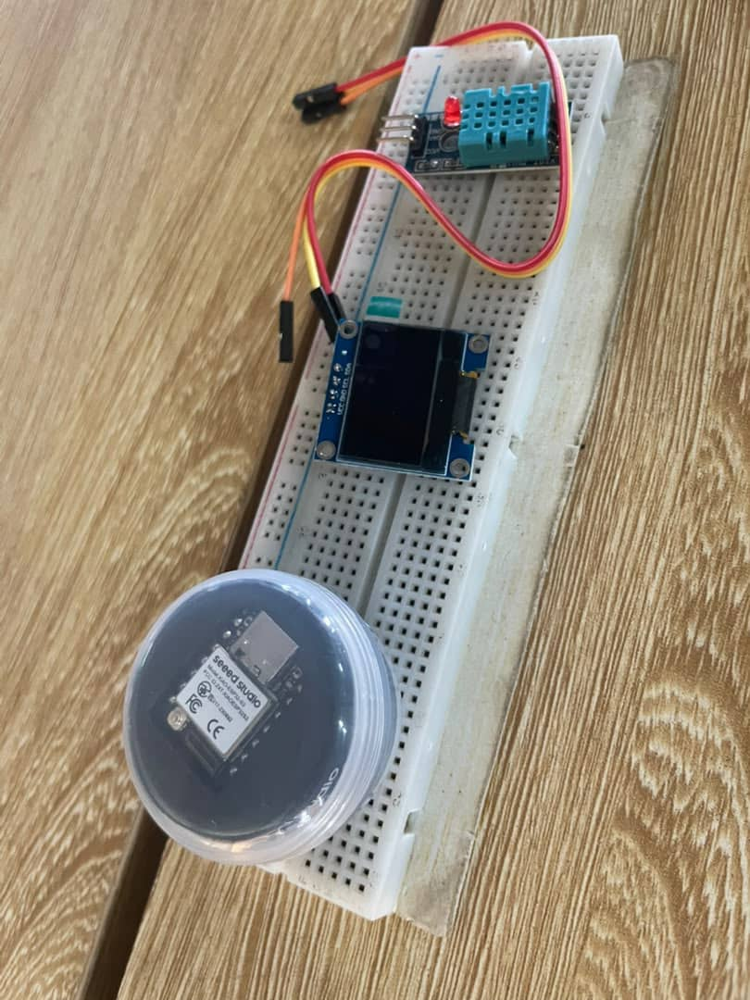
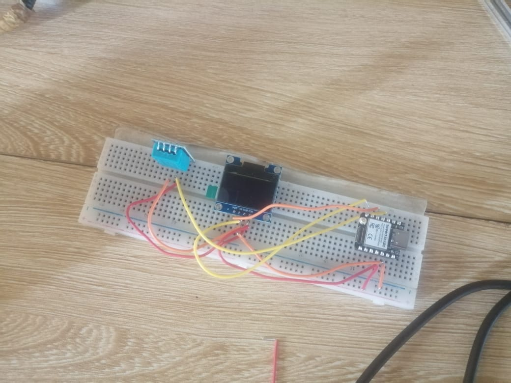
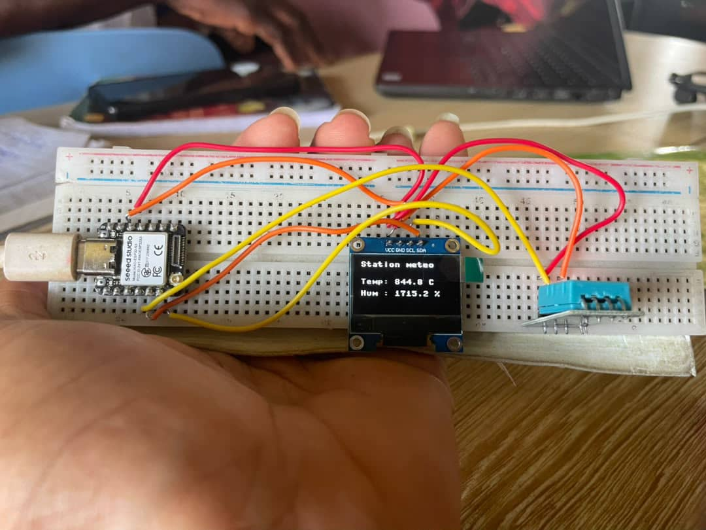

## Journal du 05 Septembre 2026 (rédigé par Afi Dibaya Claire ALAKA)

## Fait aujourd'hui
- Remise des ordinateurs
- Répartition par groupes de 4
- Projet sur station météo: la séance a été consacrée à la réalisation d'une station de mesure connectée permettant de mesurer la température et l'humidité de l'air à l'aide d'un capteur DHT22 et d'afficher les résultats sur un écran 0LED 

# Matériel utilisé
- Carte Seeed XIA0 SP32-S3
- Capteur DHT22
- Ecran OLED
- Plaque d'éssai 
- Câble USB-C
- Ordinateur avec Thonny installé
- Fils de câblage mâle-mâle

# Déroulement de la manipulation
- Eape 1: identification du matériel
Nous avons commencé par identifier les différents composants nécessaires au montage, les broches VCC,GND,et le SIGNAL du DHT22 ainsi qu'aux broches SDA, SCL de l'écran OLED
- Etape 2: préparation du montage
nous avons utilisée la breadboard comme support pour réaliser les connexions entre la carte XIAO SP32-S3, le capteur DHT22 et l'écran OLED.
- Etape 3: Câblage de DHT22: 
VCC est relié à 3V3 d'ESP32-S3, 
DATA à GPIO4 ESP32-S3, 
GND à GND d'ESP32-S3, 
- CâBLAGE DE ESP32-S3:
 3V3 est relié à VCC DHT22, 
 GND à GND DHT22 et à GND OLED, 
GPIO4 à DATA DHT22, 
SDA à SDA OLED, 
SCL à SCL OLED,  
- Câblage écran OLED: 
VCC est relié à VCC d'ESP32- S3, 
GND à GND ESP32-S3, 
SCL à SCL ESP32, 
SDA à SDA ESP32, 
Avant la mise sous tension, nous avons verifié les connexions afin d'éviter une mauvaise alimentation 
- La programmation: la carte ESP32-S3 est ensuite programmée afin de récupérer les données du DHT22; lire la température et l'humidité; transmettre les valeurs à l'écran OLED et afficher les mésures

## Résultat obtenu
- Á la fin de la séance, nous avons obtenu un prototype de station de mesure connectée composé de la carte XIAO ESP32-S3, du capteur DHT22 et de l'écran OLED qui affiche la température et le taux d'humidité
- Le système est capable de mesurer la température et l'humidité et d'afficher les résultats sur l'écran

## Appris
- Le montage permet de récupérer les informations fournies par le capteur. L'écran OLED est utilisé comme interface d'affichage des mésures
- La réalisation du montage m'a également permis de comprendre l'utilisation d'un microcontroleur, d'un capteur numérique et d'une communicaton I²C
- Cette séance m'a permie de mettre en pratique plusieurs notions liées à l'électronique et à l'internet des objets.J'ai appris à identifier les composants, réaliser leurs câblage sur une breadboard et comprendre le rôle de la carte XIAO ESP32-S3 dans l'acquisition et le traitement des données 

## Raté, puis corrigé
- Au cours de la manipulation, nous avons rencontrez des difficultés comme : l'indentification des broches des composants, le respect des connexion VCC et GND; le raccordement des lignes SDA et SCL de l'écran OLED; la programmation et la détection des composants par la carte.Ces difficultés on été résolues grâce à la vérification et à des éssais successifs.

## Décidé
- Je vais revoir le chéma de câblage des composants 
- Revoir mon cours sur la programmation et de l'élctronique

## Á Faire demain
Faire la modèlisation

