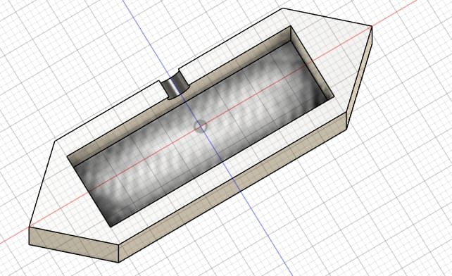

## Journal du 10 Septembre 2026(rédigé par Afi Dibaya Claire ALAKA)

## Fait aujourd'hui
- Nous avons conçu une structure avec une partie exterieure et un espace interieur destiné à recevoir des composants électroniques
- Nous avons réalisé  les formes nécessaires pour acceullir les afficheurs 7Segments
- Vérification de l'assemblage et les dimensions du modéle
- Nous avons également observé les premières pièces fabriquées en impression 3D et vérifié leurs correspondance avec le modèle numérique

## Appris
-J'ai appris à utiliser Fusion 360 pour modèliser un boîtier.
- Créer des évidements et des logements pour les composants.
- L'importance de respecter les dimensions et les jeux nécessaires avant la fabrication 

## Raté, puis corrigé
- Certaines dimensions et certains ajustements ne correspondaient pas parfaitement aux élements à intégrer
- Nous avons repris la modèlisation dans Fusion 360 afin de corriger les dimensions et améliorer l'emplacement des composants.

 
## Décidé
- nous avons décidé de conserver cette conception comme base du tableau de score de notre projet
- Finaliser la conception du boîtier.
- Vérifier l'emplacement de chaque afficheurs.
- Préparer les pièces restantes pour l'impession 3D

## À Faire demain 
- Finaliser et exporter le modèle Fusion 360
- Imprimer les pièces restantes
- Souder les rubans LED dans les afficheurs 7 Segment