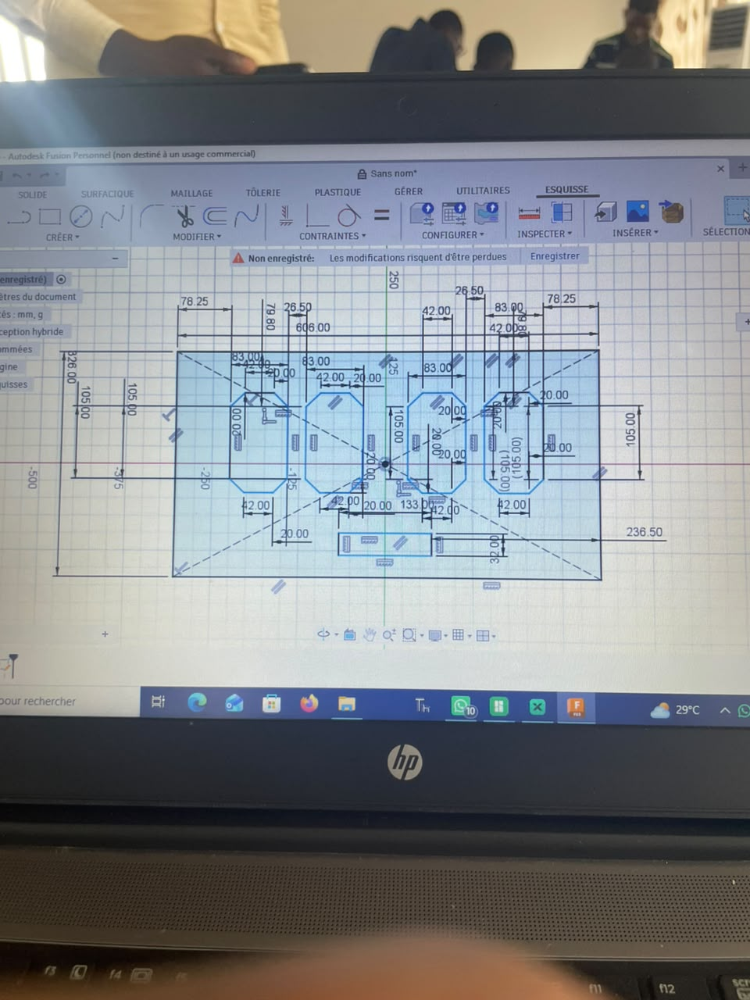

## Journal du 14 Septembre 2026 (rédigé par : Afi Dibaya Claire ALAKA)

## Fait aujourd'hui
Conception et fabrication d'un Tableau de score sportif
- Finalisation de la conception du support du tableau score sur Fusion 360
- Réalisation des découpes dans le contreplaqué à l'aide de la fabrication numérique
- Obtention des différentes pièces avec des assemblages à encoches
- Réalisation des opouvertures destinées aux afficheurs 7 segment 
- Préparation de la façade du tableau avec les indications HOME, AWAY et min/sec
- Vérification de l'emplacement et des dimensions des différents afficheurs 
  
     

## Appris
- J'ai appris à transformer une conception réalisée sur ordinateur en pièces physiques grâce à la découpe Laser.
- j'ai également appris à assembler les éléments découpés et à vérifier leur alignement

## Raté, puis corrigé
- Le positionnement et l'alignement des cadres des afficheurs lors de la modèlisation sur fusion 360 n'etaient pas correcte
- Nous avons repris le positionnement des pièces et effectué quelques ajustements afin d'obtenir un assemblage plus précis

## Décidé
- Finaliser la fixation des afficheurs 7 segment
- Vérifier les dimensions et l'alignement de tous les composants
- Préparer l'installation et le raccordement de la partie électronique

## À faire demain
- Souder les LED dans les afficheurs 7 Segments
- Installer les afficheurs LED dans leurs cadres
- Réaliser les connexions électriques
- Tester l'affichage des scores des deux équipes HOME AWAY 