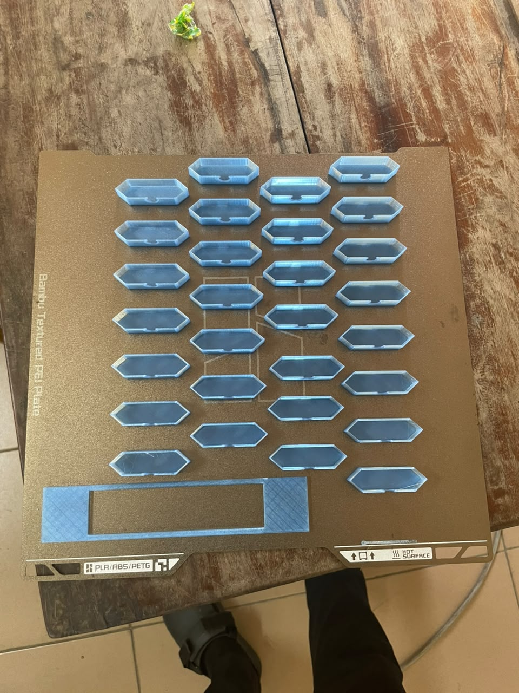
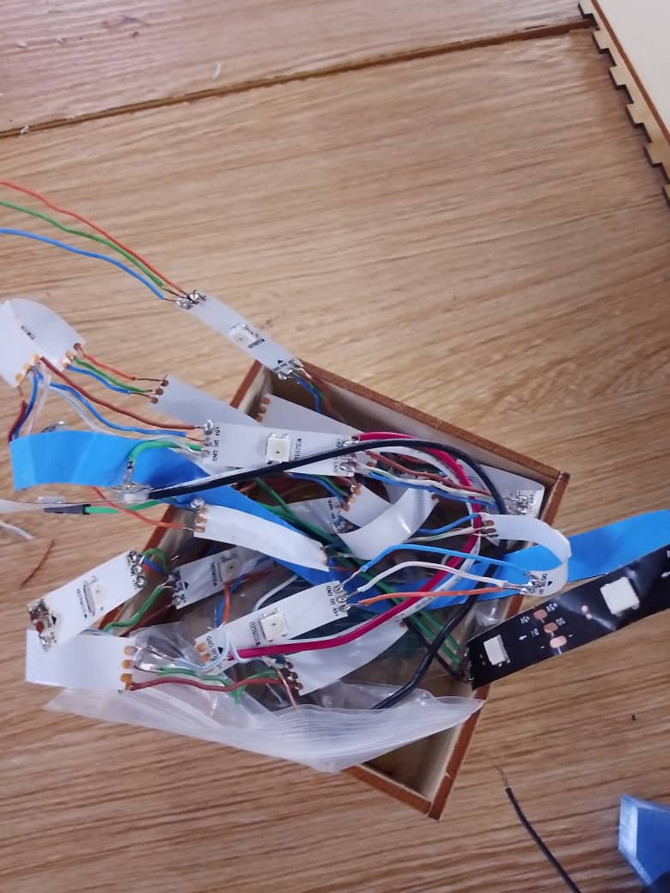
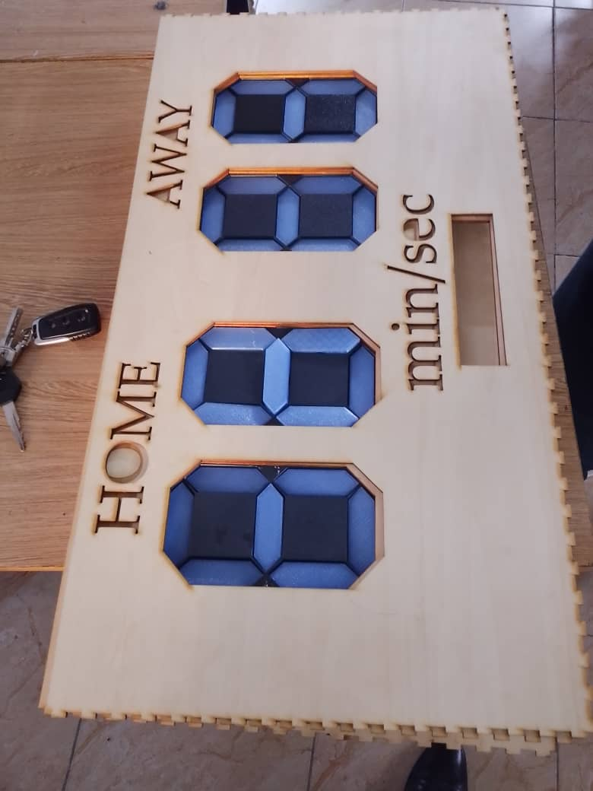

## Journal du Mardi 15 Septembre 2026 (rédigé par Afi Dibaya Claire ALAKA)

## Fait aujourd'hui
- Impression des couvres pour les afficheurs 7 segments
- Réalisation de la soudure des rubans LED en série, connexion des pistes VCC, GND et DATA entre chaque module pour créer une chaîne de 7 LED pour l'affichage du tableau de score
- Réalisation du circuit sur la breadboard à l'aide d'une carte XIAO ESP32 et des fils de connexions
- Test d'allumage avec la programmation python

## Appris
- J'ai appris à réaliser les connexions entre 7 LED 
- J'ai compris l'importance de respecter les bornes VCC, GND et DATA

## Raté, puis corrigé
- Lors du test d'allumage, une seule LED s'est allumée sur les 7 soudées après une encore . Les autres ne s'allumaient pas malgré le téléversement du code
- Nous n'avons pas puis le corriger 
- Nous avons eu un manque de LED pour les afficheurs 7 segments
  
## Décidé
- Vérifier toutes les connexions et la soudure
- Continuer le test d'allumage des LED

## À faire demain
- Tester tous les afficheurs LED
- Tester l'affichage des différents scores
- Corriger les éventuels problèmes de connexion
- Effectuer un test général du tableau de score sportif