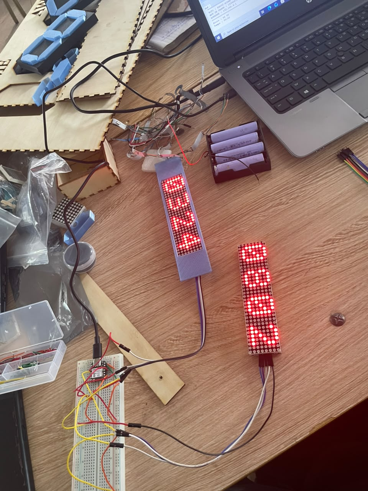
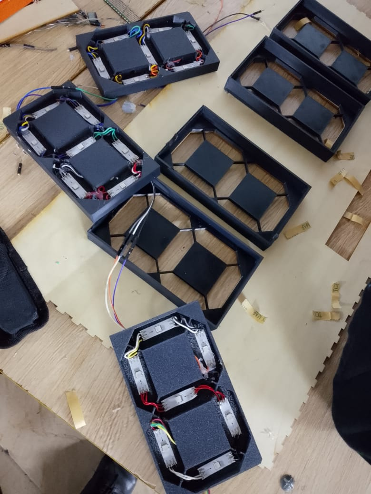
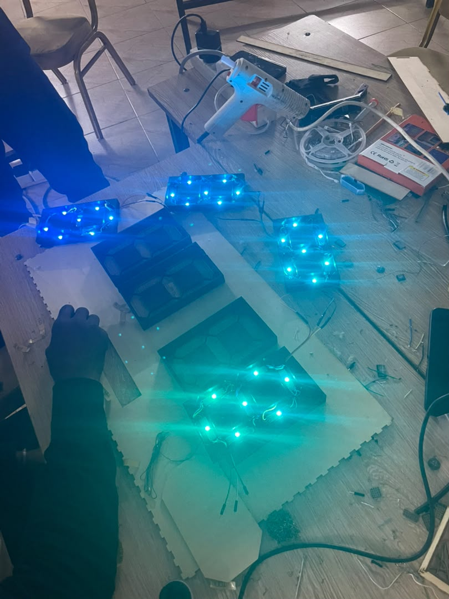
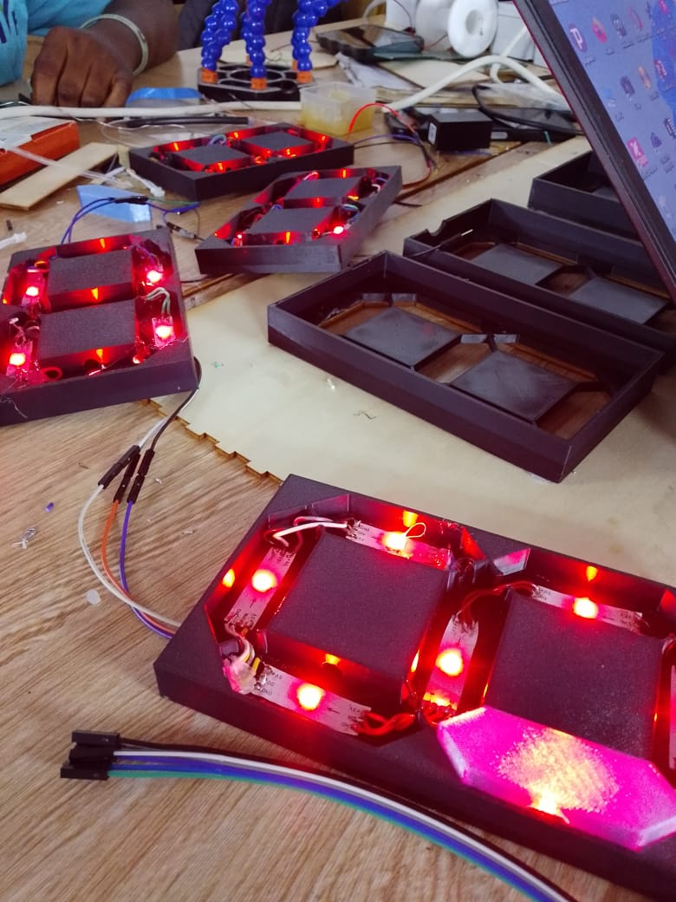

## Journal du Mercredi 16 Septembre 2026 (rédigé par Afi Dibaya Claire ALAKA)

## Fait aujourd'hui
- Brachement des matrices LED au système d'alimentation 
- Test d'allumage des LED matrices afin de vérifier leur fonctionnement
- Mise en place progressive des différents chiffres des scores et de la periode
- soudure des LED rubans et leurs fixation dans les afficheurs 7 segment
- Test d'allumage des afficheurs afin de vérifier leurs fonctionnement

## Appris
- Comment réaliser les connexions entre plusieurs afficheurs
- L'importance de respecter la polarité et de vérifier les connexions avant la mise sous tention 
- comment tester progressivement un système électronique avant son assemblage final

## Raté puis corrigé
 Au debut les LED matrice foctionnaient normalement avec le code de programmation. Lors du test d'alimentation sur la batterie, les LED matrices ne se sont plus allumés. Malgré plusieurs vérifications du câblage et du branchement, nous n'avons pas pu identifierl'origine de la panne. Le problème persiste. Nous avons dû les remplacés par des LED rubans 

## Décidé
Nous avons décidé de valider chaque module séparément avant de réaliser le montage final

## À faire demain
Finaliser le câblage, effectuer un test général et commencer la fixation définitive des composants et affiché les scores des deux équipes et la période