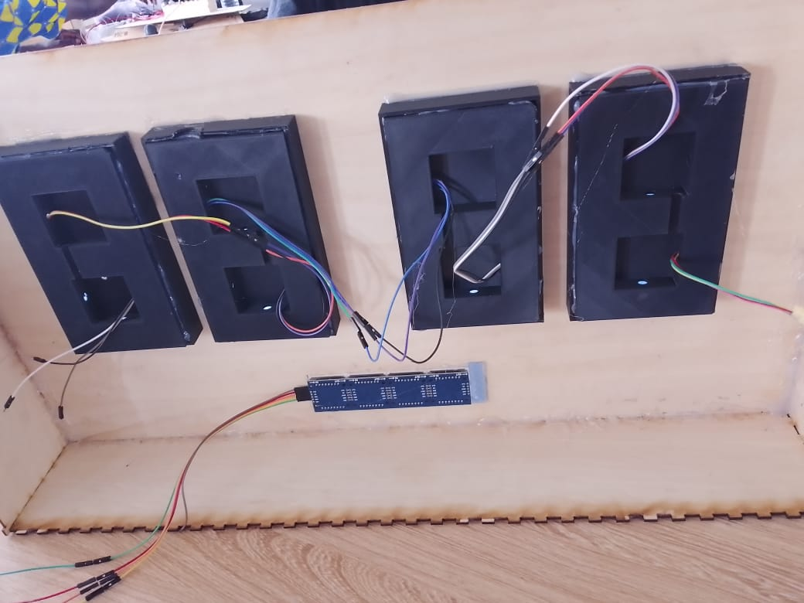
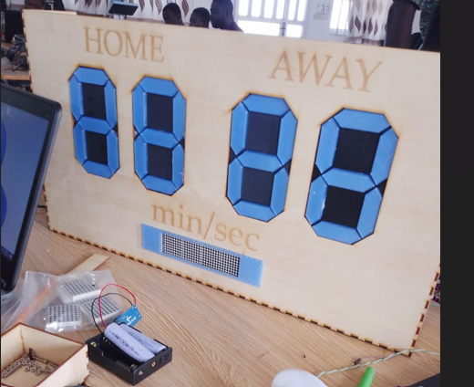
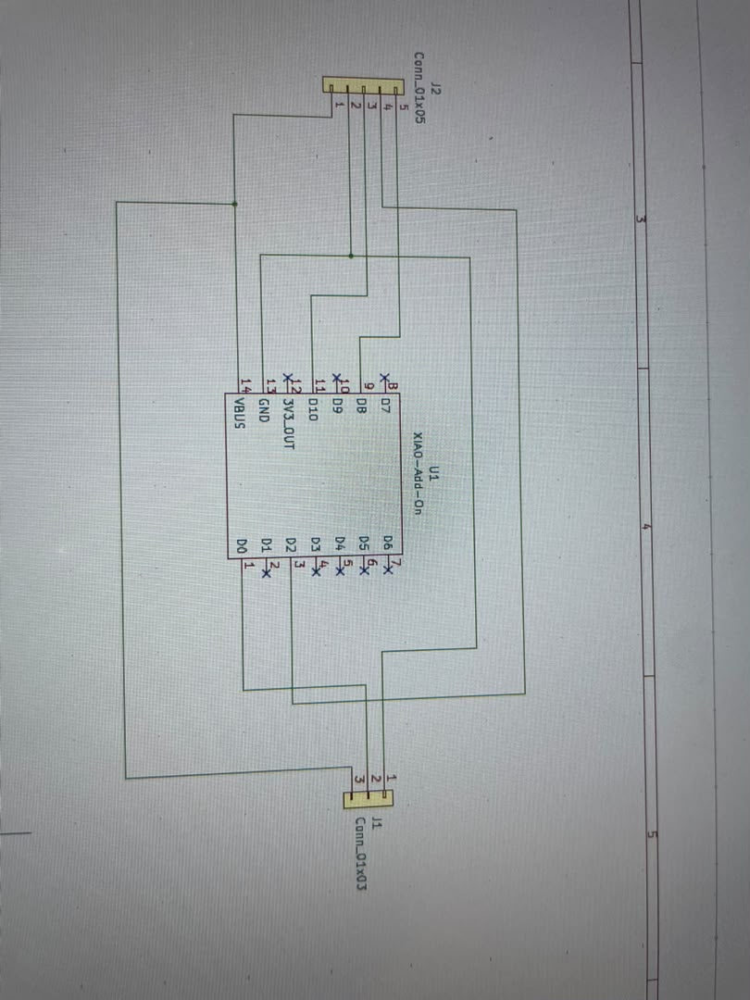
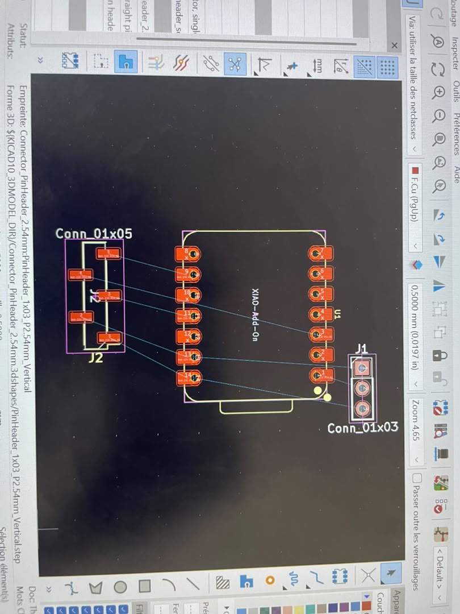
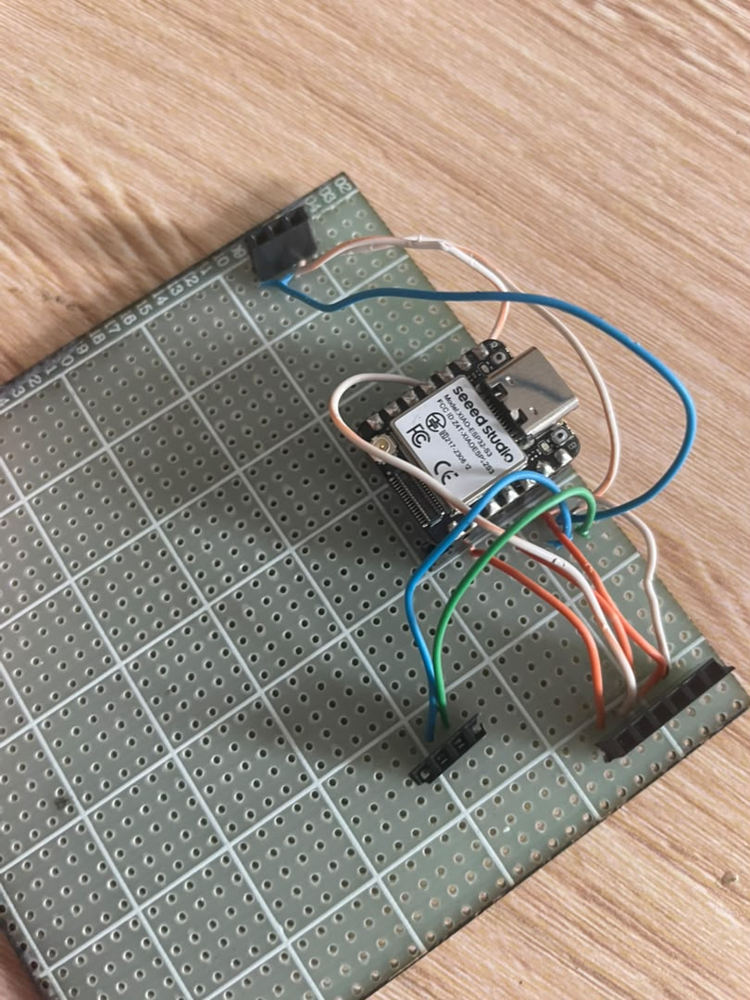
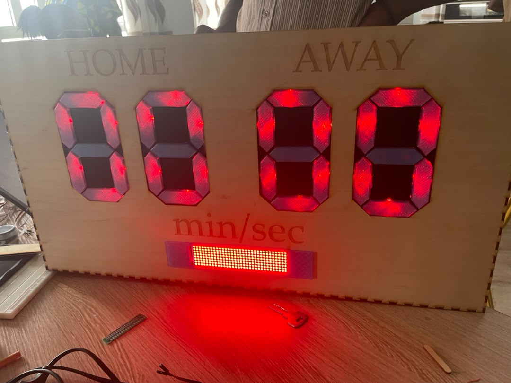

## Journal du Jeudi 17 Septembre 2026 (rédigé par : Afi Dibaya Claire ALAKA)

## Fait aujourd'hui
- Fixation des quatre boîtiers 7segments imprimés en 3D 
- Conception du circuit et du PCB
- Câblage complet: collage en série des 4 afficheurs + connexion de la matrice LED
- Intégration du module batterie et test d'alimentation autonome

## Appris
- Câblage du microcontroleur ESP32, de la LED matrice et des rubans de LED
- J'ai appris à tester le fonctionnement des afficheurs 7 segments et de la LED matrice
- Utilisation d'une batérie pour l'alimentation 
- Programmer et téléverser un code du micropython
- J'ai compris l'importance d'une alimentation et d'un câblage correctement réalisés

## Raté, puis corrrigé
- Nous avons eu un problème au niveau de l'affichage des scores et de la période, les chiffres se sont renversés
-  Nous avons vérifié les connexions et corrigé les branchements avant de refaire les tests

## Décidé
Nous avons décidé de poursuivre les tests et de vérifier chaque connexion avant l'assemblage définitif du tableau

## À faire demain
- Corriger les éventuels problèmes électriques ou de programmation 
- Préparer le prototype pour la démonstration finale