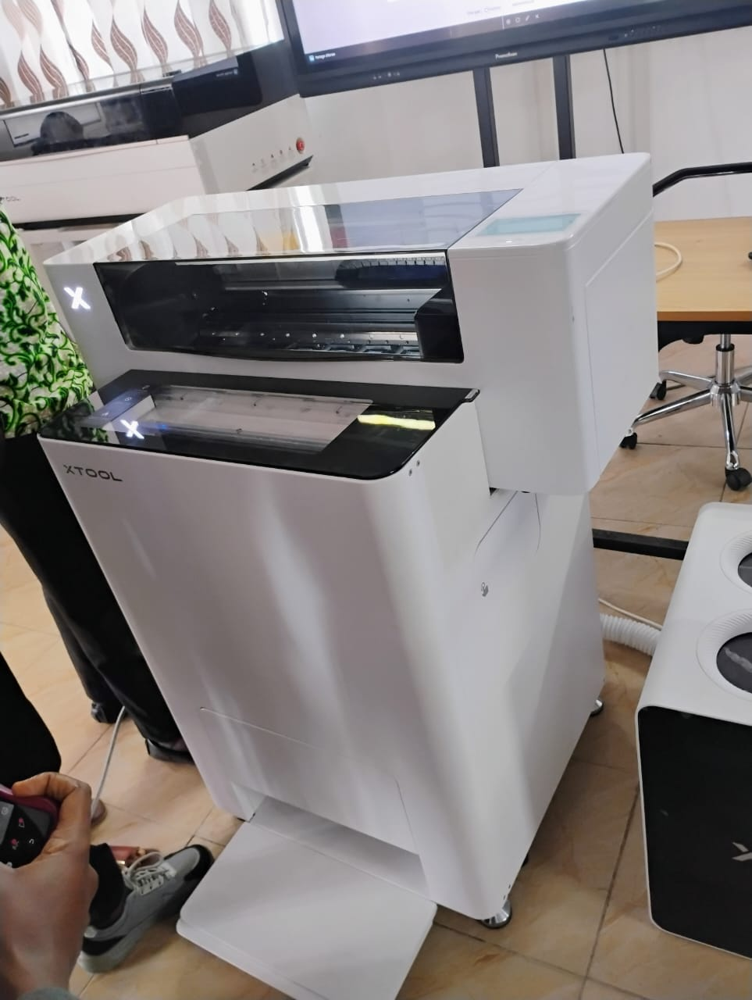
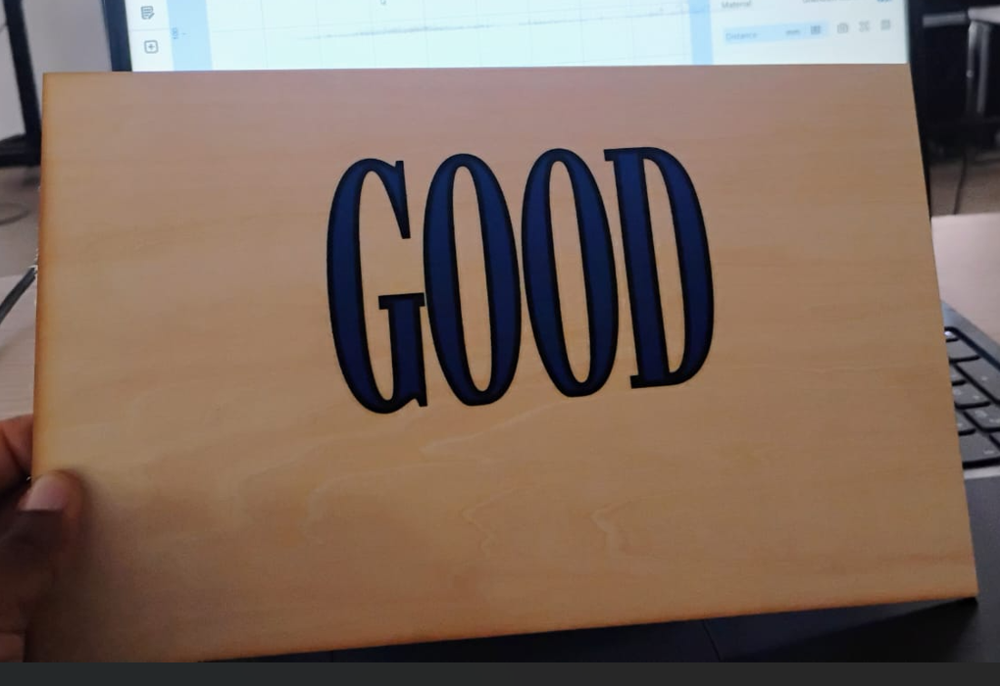
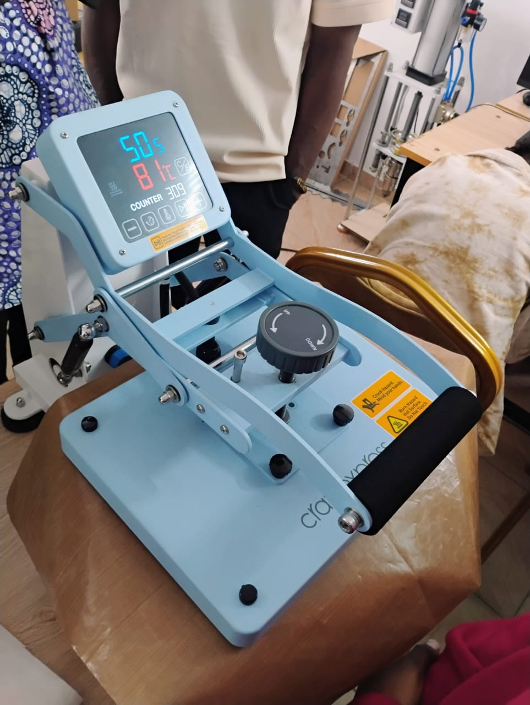
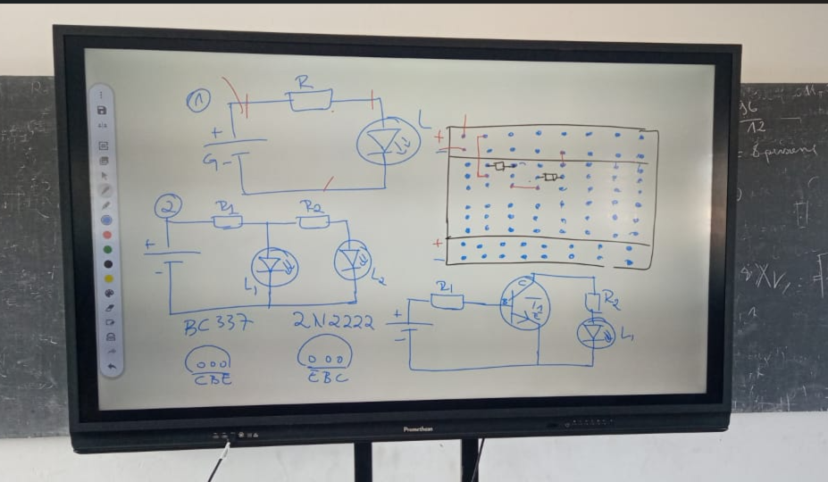
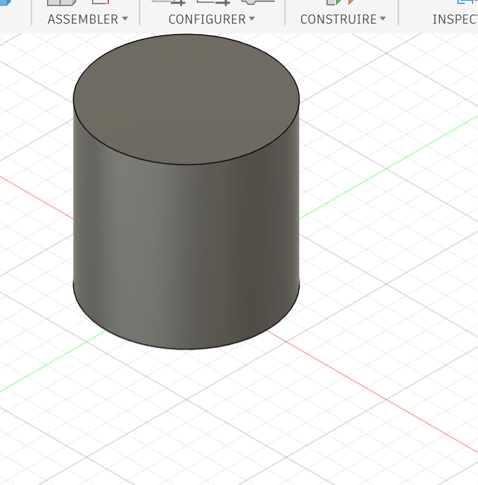

## Journal du O1 Septembre 2026 (rédigé par Afi Dibaya Claire ALAKA)

## Fait aujourd'hui
- Contrôle de présence
- Répartition des ateliers par groupes et par rotation

## Appris
# Atelier de découpe laser
- La technique d'impression DTF et son utilisation
- Les étapes de l'impression DTF à savoir: concevoir, imprimer, poudrer, cuir, presser et rétirer
- Identifier les éléments d'une chaîne d'impression DTF qui sont: Imprimante DTF, Film DTF, Encres DTF C, M,J,N et blanc, poudre adhésive thermofusible, Four/poudre-cuisson presse à chaud et vêtement à personnaliser
- Le DTF permet de personnaliser tous types de textiles avec des couleurs vives et résistantes
- Consevoir un exemple de photo sur un T-shirt et l'imprimé à la machine 

# Atelier d'Electronique
- Notion sur la Breaadboard SK10
- Réalisation des circuits sur une plaquet SK10

.jpg)

## Atelier de projet
la modèlisation sur Fusion 360 en 3d

## Raté pui corrigé
Aujourd'hui j'ai mal réaliser les circuits sur la plaquette SK10 et avec l'aide j'ai pu le corriger
 
## Décidé
je vais revoir mon cours sur les circuits 